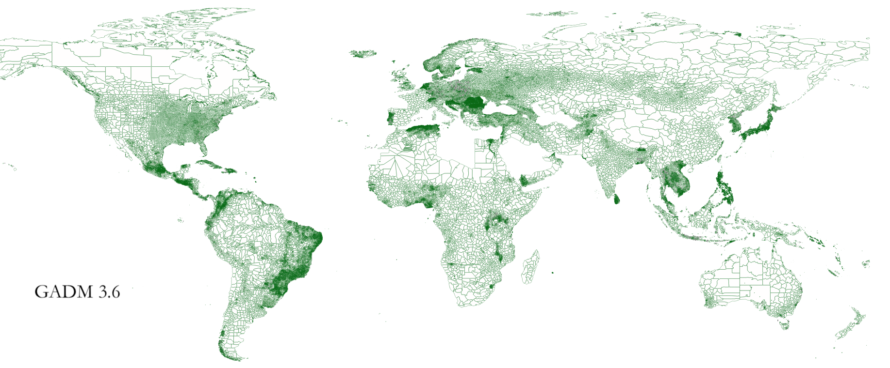
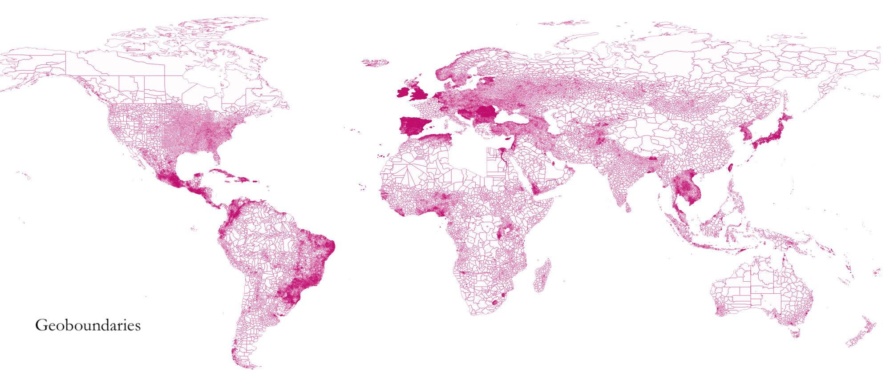

### Repairing Admin 2 boundaries
Open source admin 2 boundaries have missing countries & invalid geometries. [Following shapefile: gadm_wag_adm2](https://drive.google.com/drive/folders/1SVScz3jQImsQ666BulbUPu2QQdnaMZ5U?usp=sharing) combines across multiple shapefiles in an attempt to create consistent admin2 shapefiles.  Github did not allow for large file upload (bit lazy for lfs), shapefile is in gdrive.

### Background

#### Publicly Available Admin boundaries
* [Gadm](https://gadm.org/)
* [Geoboundaries](https://www.geoboundaries.org/downloadCGAZ.html)
* [Gaul](https://www.geoboundaries.org/downloadCGAZ.html)
* [Polio](https://polioboundaries-who.hub.arcgis.com/datasets/6b44e83b8efe45c89e22d2721ec824bb_4?geometry=157.500%2C-74.194%2C-157.500%2C78.781)
* World Agglomerated

#### Repair stages
* Add countries from other shps
  + Tried wag, gaul, and geoboundaries
  + Used wag (did not take islands, GRN, Antarctica)
  + Added 22 countries from wag
* Remove polygons with area < 0.01 sqkm
  + This helped in repairing additional unaccounted for polygons
  + Initially dim(shp) > unique(polygons)
* Remove polygons with y coordinates > 75
  + This is specific, executed for raster extraction (so some parts of Russia are not here)
  + NL raster polygon does not cover y coord > 75

#### Maps

